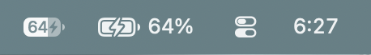

# Better Battery

Better Battery is a tiny, free menu bar utility for macOS 27 Golden Gate.

Golden Gate gives the system battery indicator a clean, iOS-inspired design,
but putting the percentage inside the battery makes it harder to read at a
glance. Better Battery restores that legibility without trying to become a
battery-management suite.



The first indicator is macOS 27's compact percentage. Better Battery is shown
beside it with a larger battery icon and clearly separated percentage.

## Download

[Download the latest version of Better Battery](https://github.com/apollozac/Better-Battery/releases/latest/download/Better-Battery.dmg)

Better Battery requires macOS 27 or later. Open the disk image, drag
**Better Battery** to Applications, and open it. The downloadable build is
signed and notarized by Apple.

## What it does

- Shows a percentage-matched battery icon with the percentage beside it.
- Shows charging and external-power states.
- Offers a percentage-only mode designed to sit beside Apple's battery icon.
- Displays battery condition, maximum capacity, and cycle count in Settings.
- Can open automatically when you log in.
- Checks for signed updates and can install them automatically.
- Uses native macOS power notifications with a low-frequency safety refresh.
- Includes no accounts, analytics, or advertising.

That is intentionally the whole app: no charge limits, automation, or
background dashboards.

## Energy use

Better Battery is designed to use effectively negligible resources. In a
three-hour measurement covering charging, full charge, unplugging, and battery
use, it consumed 1.88 seconds of CPU time—about 0.017% of one CPU core on
average. Sampled power impact remained at 0.0 throughout.

## Build from source

Better Battery is a Swift Package and builds against the macOS 27 SDK.

```sh
./script/build_and_run.sh
```

Run the tests with:

```sh
swift test --disable-sandbox
```

Maintainers can create signed and notarized ZIP and DMG releases with:

```sh
BETTER_BATTERY_NOTARY_PROFILE="your-notarytool-profile" ./script/package_dmg.sh
```

After uploading the ZIP to a GitHub release, generate the signed Sparkle feed
for that version with:

```sh
./script/generate_appcast.sh 1.5.0
```

## Privacy

Better Battery reads battery and power-source information supplied locally by
macOS. Its only network activity is checking the public signed update feed and
downloading an update when one is available. It does not collect, transmit, or
sell user data, and it contains no analytics or advertising frameworks.

## License

Better Battery is available under the [MIT License](LICENSE).

Better Battery is an independent app and is not affiliated with Apple Inc.
